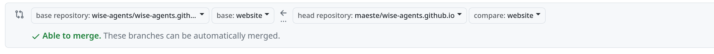

# How to publish wise-agents documentation

* Fork and clone this project. Your local directory should be ```wise-agents.github.io```
* Be sure to have a forked and cloned [wise-agents](https://github.com/wise-agents/wise-agents). Your local directory for wise-agents should be ```../wise-agents```
* Build wise-agents project
* from ```wise-agents.github.io``` just run ```make``` it will build docs from ```../wise-agents``` and push it in a remote branch called ```website```
* go to github and create PR like this 
* merge it
* your documentation will be shortly availabel to [https://wise-agents.github.io/](https://wise-agents.github.io/)